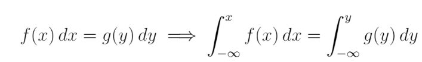
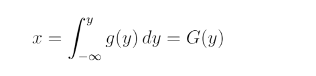
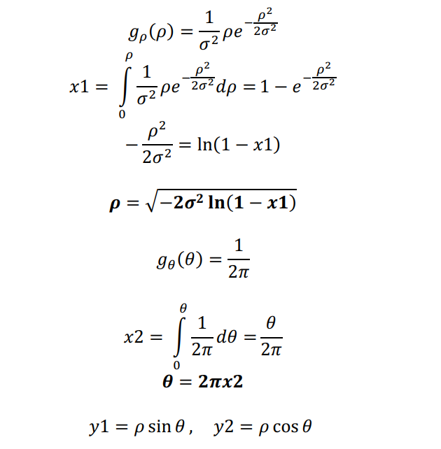

# Central Limit Theorem
According to the central limit theorem, as long as the sample size is large enough,
the sampling distribution of the mean will always be Gaussian,
Regardless of the population distribution.
The assignment consists of a Python script that generates a random sample collection 
N1 from a uniform distribution and calculates its mean. This process is repeated N2 times
to obtain a sampling distribution of the mean.  
Also, we can see as number of samples increase, the width of distribution decrease.
# Changing the distribution using a transformation function 
This assignment demonstrates how to transform a random variable with a given distribution function into another random variable with a desired distribution function, using a suitable transformation function.
- Generate a random sample from a uniform distribution on the interval (0, 1) using the random module.
- Define a target distribution function g(y) that specifies the desired distribution of the transformed variable y.
- Find the cumulative distribution function G(y) of g(y) by integrating g(y) over y.
- Find the inverse function y = G^(-1)(x) of G(y) by solving G(y) = x for y in terms of x.
- Apply the inverse function to the random sample to obtain the transformed sample y = G^(-1)(x).

## why it works
Suppose we have a generator with p(x) distribution function.
As a result, the probability of this generator delivering a number in
(x, x+dx) interval is p(x)dx. We are looking for a function that produces a variable y by applying it to x which obeys from g(y) distribution function.
In this case, the probability of having a number in the (y,y+dy) interval should be equal to g(y)dy.
As a result, we have: p(x)dx = g(y)dy  
if p(x) is the random generator of computers, it is equals to 1 in 0<x<1 and zero else where.
we can have        
So, y can be the inverse of G(x). 
For Gaussian distribution we have:  
  
In this form, G(y) cannot be expressed in elementary functions. to solve this issue, we can generate two random
numbers Y1 and Y2 from x instead of one, with a change of coordinates to polar coordinates: 
  
in this assignment, I provide a python script for Y1 and Y2 with different Deviation from the standard.

